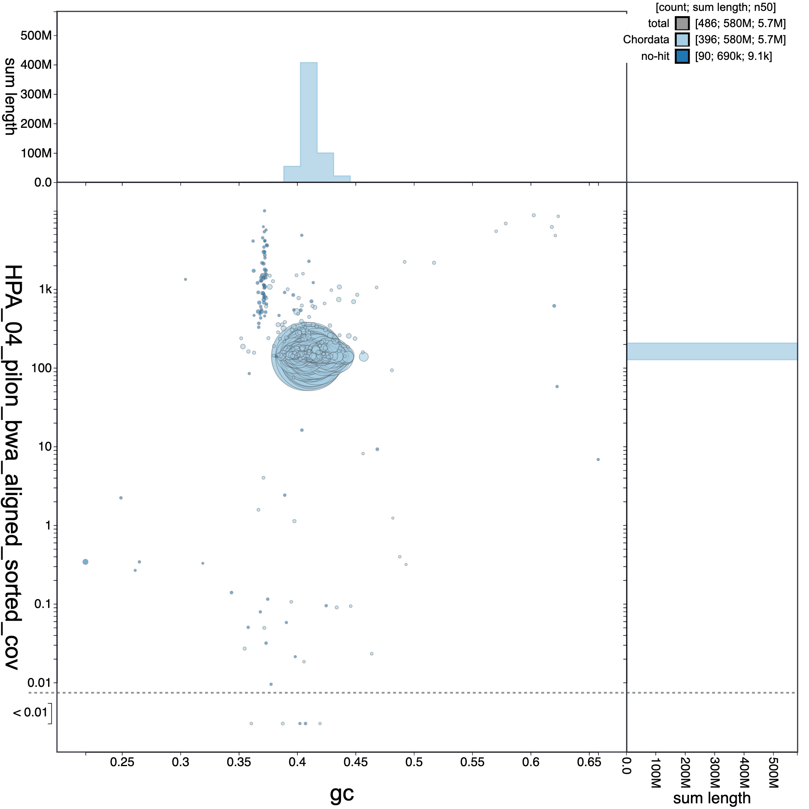
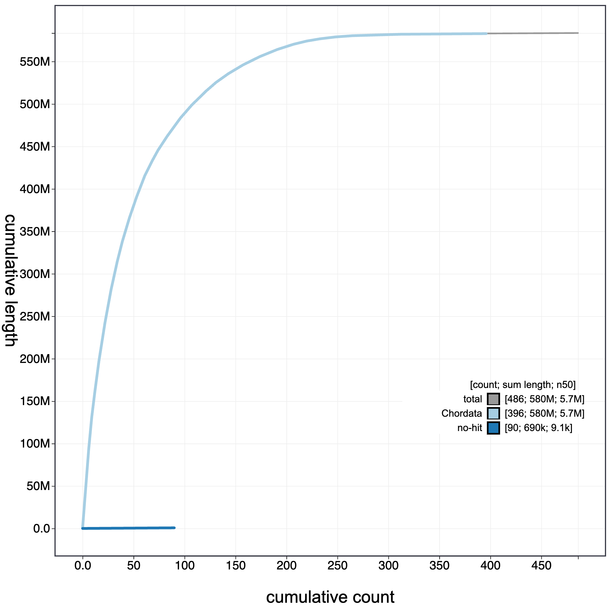
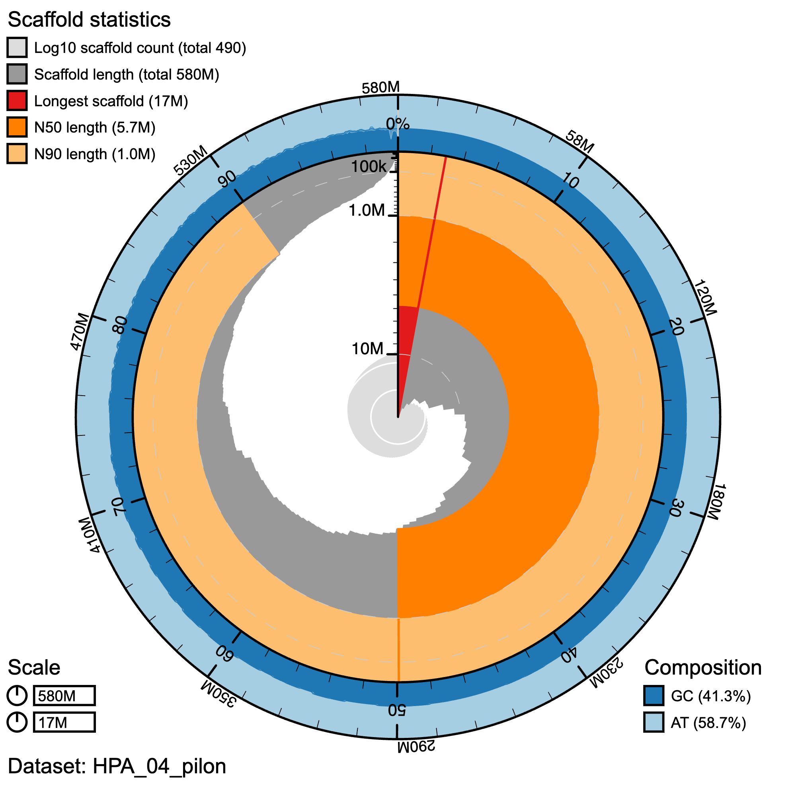

# Blobtools

blobtools was run by Carlos at STRI. Results are found in the directory `/Volumes/RG\ Genomics/HPA_Genome_Assembly/HPA_genome/Remy_GeMoMa_tables\ \(1\)/HPA_04_pilon_for_blobtools`

Navigate to the directory and to view results, in a terminal window do 

```bash
conda activate blobtools2
blobtools host .
```

Output
```bash
WARNING: Directory '.' appears to be a BlobDir.
         Hosting the parent directory instead.
Starting BlobToolKit API on port 8000 (pid: 21957)
Starting BlobToolKit viewer on port 8080 (pid: 21960)
Visit http://localhost:8080 to use the interactive BlobToolKit Viewer.
```

copy the URL `http://localhost:8080`into the web browser to view 


## Circle Plot
<p align="center">

</p>

## Cumulative Plot
<p align="center">

</p>

## Snail Plot
<p align="center">

</p>

## Final Plot
<p align="center">

</p>


