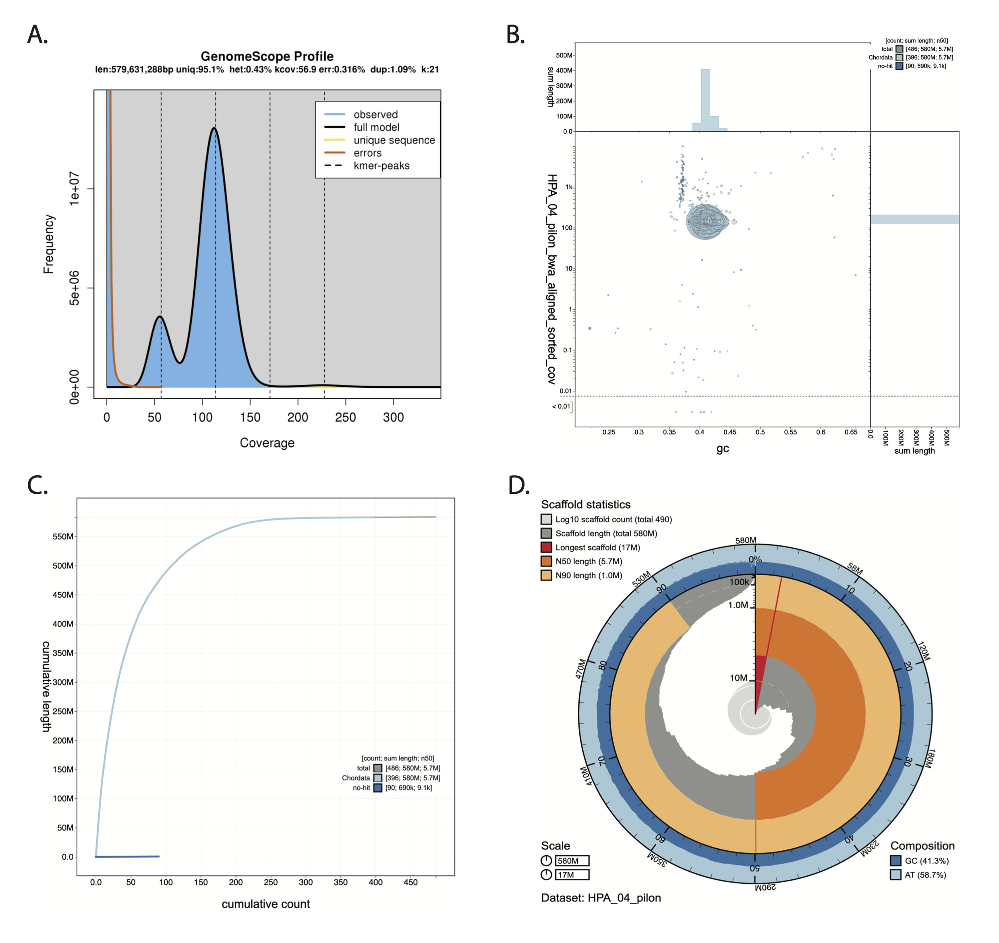

# Blobtools

blobtools was run by Carlos at STRI. Results are found in the directory `/Volumes/RG\ Genomics/HPA_Genome_Assembly/HPA_genome/Remy_GeMoMa_tables\ \(1\)/HPA_04_pilon_for_blobtools`

Navigate to the directory and to view results, in a terminal window do 

```bash
conda activate blobtools2
blobtools host .
```

Output
```bash
WARNING: Directory '.' appears to be a BlobDir.
         Hosting the parent directory instead.
Starting BlobToolKit API on port 8000 (pid: 21957)
Starting BlobToolKit viewer on port 8080 (pid: 21960)
Visit http://localhost:8080 to use the interactive BlobToolKit Viewer.
```

copy the URL `http://localhost:8080`into the web browser to view 


## Circle Plot
<p align="center">

</p>

## Cumulative Plot
<p align="center">

</p>

## Snail Plot
<p align="center">

</p>


## Final Plot
<p align="center">

</p>

**Figure 2.** Genome assembly summary statistics of Holacanthus passer. Visualizations were generated using GenomeScope VX (A) and Blobtoolkit Viewer (B-D). (A) Histogram of the 21 k-mer distribution of Illumina short reads. The highest frequency of k-mer coverage was seen around 110X (excluding k-mers with low coverage). (B) Blob plot showing the distribution of assembly scaffolds based on GC proportion and coverage. Circles are colored by phylum and circle size is relative to the number of sequence length. (C) Cumulative assembly plot showing curves of subsets of scaffolds assigned to each phylum relative to the overall assembly. (D) Snail plot summary of the genome assembly statistics. The outermost ring of the entire plot represents the full length of the genome assembly of Holacanthus passer (583,528,366 bp). The dark blue and light blue shaded area represents the GC and AT content across the entire genome, respectively. The second ring shows the percentage of total contigs (second black line), with the light orange shade indicating the N90 (1,000,532 bp) and dark orange shade the N50 (5,708,022 bp). The dark grey bars represent the scaffolds and are organized from largest (shown in red) to smallest. The radius of the circle indicates the size of each scaffold and helps visualize the percentage of large versus small scaffolds.


