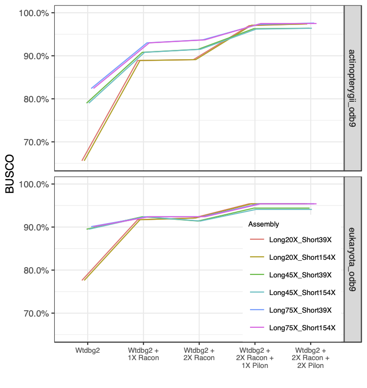
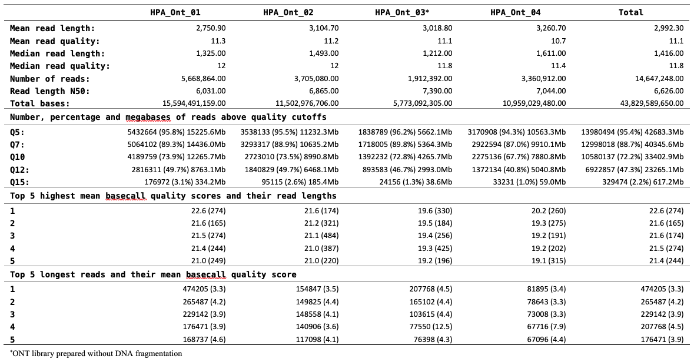

# Whole genome assembly of the King Angelfish (*Holacanthus passer*) gives insight into the evolution of marine fishes of the Tropical Eastern Pacific
### (Gatins *et al* in prep)
Here you will find a stepthrough to the entire *Holacanthus passer* genome assembly protocol we carried out using Oxford Nanopore and Illumina sequencing. The genome assembly pipeline is illustrated below. Other step by step methods used to assess and analyse data (e.g. GenomeScope and PSMC) are also shared. 

Overall the goal of this page was to write a tutorial for my fellow labmates, however, it is also useful for other early career scientists or beginners in bioinformatics to replicate some of these analyses. I am far from an expert programmer or bioinformatician &mdash; I spend a significant amount of time troubleshooting on google &mdash; so if anyone finds any problems with my code please let me know! =)

I hope you find this a useful resource.

As hybrid assemblies that combine long and short sequences become more common, there is a consistent ambiguity on the amount of coverage one needs from each sequencing technology. Both technologies are important during different steps of the assembly, however, should resources be focused more towards one technology rather than the other? In order to help others plan the amount of coverage they will need accordingly, we have assessed the BUSCO completeness using subsets of the raw sequencing data of the *H. passer* genome after the initial assembly and subsequently after each polishing step. Subset coverage was calculated using the the final *H. passer* genome size of 583 Mb.
**NOTE:** Sequencing technologies and assembly pipelines continue to improve so this is only a snapshot of 

Table showing the general summary of individual flow cells of Minion Nanopore sequencing data of *H. passer*

