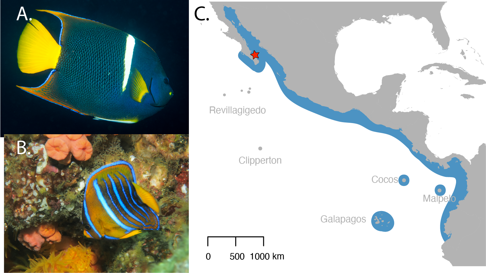

# Whole genome assembly of the King Angelfish (*Holacanthus passer*) gives insight into the evolution of marine fishes of the Tropical Eastern Pacific
### Remy Gatins, Carlos F. Arias, Carlos Sánchez, Giacomo Bernardi, Luis F. De León
### (Gatins *et al* accepted)

  **Figure 1.** Pictures of an adult male (A) and a juvenile (B) King angelfish, Holacanthus passer. Males can be identified by their white pelvic fin. The blue outline on the map (C) shows the range distribution of H. passer across the Tropical    Eastern Pacific. The red star indicates where the sample used for the genome assembly was collected from. Photo credits: Remy Gatins.

Here you will find a step-through to the entire *Holacanthus passer* genome assembly protocol we carried out using Oxford Nanopore and Illumina sequencing. The genome assembly pipeline is illustrated below. Other step-by-step methods used to assess and analyse data (e.g. GenomeScope and PSMC) are also shared. 

Overall the goal of this page was to write a tutorial for my fellow labmates, however, it is also useful for other early career scientists or beginners in bioinformatics to replicate some of these analyses. I am far from an expert programmer or bioinformatician &mdash; I spend a significant amount of time troubleshooting on google &mdash; so if anyone finds any problems with my code please let me know! =)

*Figures from the manuscript are numbered in this repository according to their number in the publication.*

**Figure 6.** Whole genome assembly pipeline using Oxford Nanopore and Illumina sequencing. Dashed orange lines indicate quality assessment checkpoints carried out during the assembly pipeline.

### Additional Resources:
- [Dryad repository](https://doi.org/10.7291/D1X10B) if link is not working copy paste the address into your browser "https://doi.org/10.7291/D1X10B" 
- [NCBI raw data repository](https://www.ncbi.nlm.nih.gov/bioproject/713824)

