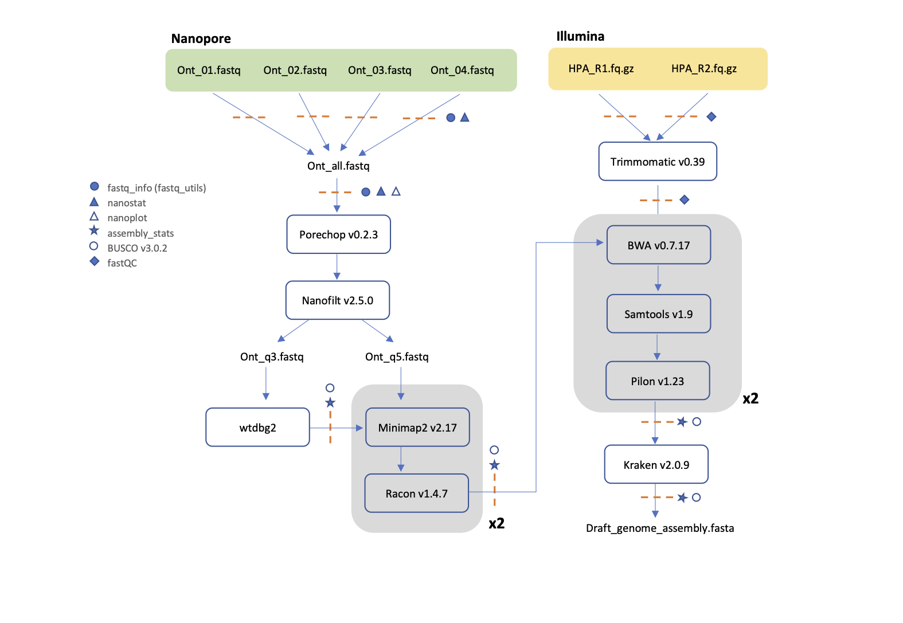

# Hybrid genome assembly of the King Angelfish (*Holacanthus passer*) using Nanopore and Illumina Sequencing
Here you will find a stepthrough to the entire *Holacanthus passer* genome assembly protocol carried out using Oxford Nanopore and Illumina sequencing. The genome assembly pipeline is illustrated below. Other step by step methods used to assess and analyse data (e.g. GenomeScope and PSMC) are also shared. 

Overall the goal of this page was to write a tutorial for my fellow labmates, however, it is also useful for other early career scientists or beginners in bioinformatics to replicate some of these analyses. I am far from an expert programmer or bioinformatician-- I spend a significant amount of time troubleshooting on google-- so if anyone finds any problems with my code please let me know! =)

